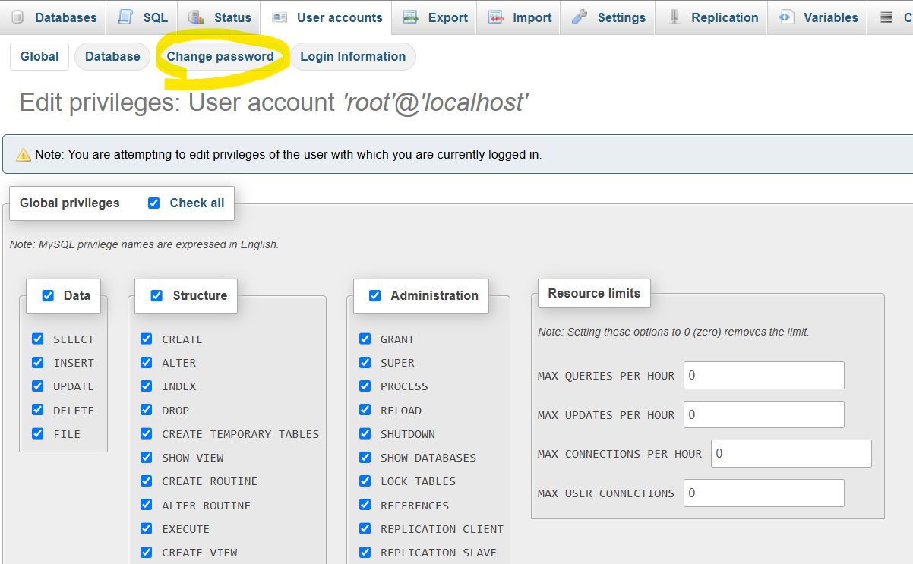
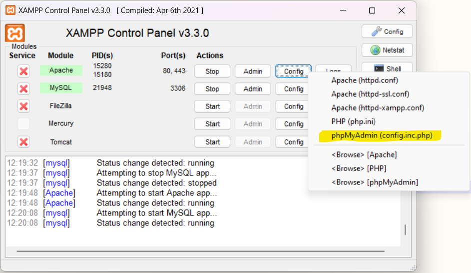

# Instructiuni de pornire cu XAMPP

1. Se porneste serverul de MySql din XAMPP.
2. Se porneste serverul Apache din interfata XAMPP.

## Pregatire baza de date

1. In [Admin-ul de mysql](http://localhost/phpmyadmin/index.php?route=/server/databases) se creaza schema de baze date cu numele *womentechpower* (default encoding)
2. Se ia [womentechpower.sql](docs/womentechpower.sql) si se importa in [Admin-ul de mysql](http://localhost/phpmyadmin/index.php?route=/database/import&db=womentechpower) din xampp, ca in ;

## Pornire site

1. Pentru functionarea site-ului trebuie sa ne asiguram ca utilizatorul 'root' de DB are parola 'root'. Daca aveti deja asa, sariti la pasul 2.
-- In Admin-ul de mysql se deschide pagina de [administrare utilizatori](http://localhost/phpmyadmin/index.php?route=/server/privileges&viewing_mode=server).
-- Se [editeaza privilegiile](http://localhost/phpmyadmin/index.php?route=/server/privileges&username=root&hostname=localhost&dbname=&tablename=&routinename=) utilizatorului 'root' de pe 'host name'=localhost. In partea de sus a paginii se apasa pe "Change password', ca in 
' O sa dea un warning, puteti sa-l ignorati pentru ca vom schimba si config-ul serverului.
-- Se inchide serverul Apache si deschidem fisierul de config pentru al edita. Vezi .
-- Va asigurati ca avem urmatoarele propietati
> $cfg['Servers'][$i]['user'] = 'root';
> $cfg['Servers'][$i]['password'] = 'root';
-- pornim serverul Apache. Verificam ca putem deschide [Admin-ul de mysql](http://localhost/phpmyadmin/index.php?route=/server/databases)
2. Se copiaza sursele proiectului in folderul \htdocs din XAMPP.
3. Se acceseaza pagina de pornire a aplicatiei. http://localhost/[numele folderului cu proiectul]/

# Clasele bootstrap folosite:

1. Navbar
- navbar:Instantiaza bara de navigare.
- navbar-expand-lg: Face ca bara de navigare sa se extinda.
- navbar-dark: Seteaza culori inchise pt text.
- bg-primary: Culoare fundal
- navbar-toggler: Buton pt afisarea meniului sandwich.
- collapse navbar-collapse: Ascunde meniul pe dispozitive mici.
- nav-item: element din meniu.
- nav-link: Stilizează link-urile din bara de navigare.

2. Container

- container

3. Sistem Grid

- row: coloane.
- col-md-4: Defineste coloane care ocupa 4/12.
- col-lg-6: Coloane care ocupă 6/12.

4. Carduri

- card: Instantiaza card.
- card-body: Continutul cardului.
- card-title: Stilizeaza titlul cardului.
- card-text: Stilizeaza textul cardului.

5. Formulare

- form-group: Grup de campuri dintr-un formular.
- form-control: Stileaza input-urile, textele.
- form-control-file: Stileaza campurile de tip fisier.
- btn btn-primary: Buton stilizat.

6. Jumbotron

- jumbotron: Instantiaza containerul mare.
- display-4: Stilizeaza un titlu mare.
- lead: Text introductiv sau subtitlu.

7. Butoane

- btn: Stilizeaza butoanele.
- btn-primary: Buton albastru.
- btn-danger: Buton rosu.
- btn-lg: Buton mare.

8. Tabele

- table: Instantiaza un tabel
- table-striped: Adaugă benzi alternante pe rânduri.
- table-hover: Adaugă efect de hover pe rânduri.

9. Footer

- footer: Structura pentru footer.
- bg-light: Fundal deschis.
- text-muted: Text gri deschis.
